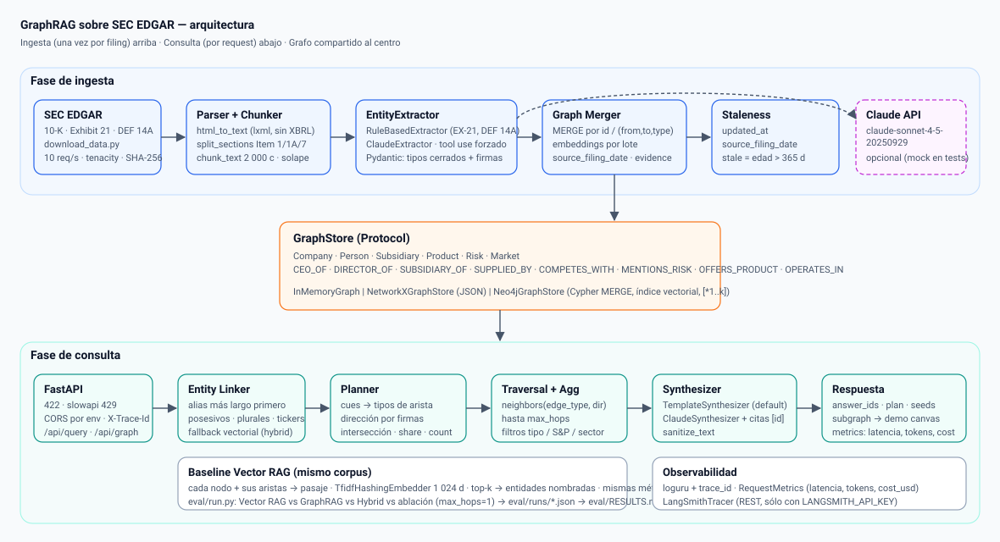

# GraphRAG sobre SEC EDGAR

[](https://github.com/Juadsuarezsan/graphrag-sec-edgar/actions/workflows/ci.yml)
[](LICENSE)
[](pyproject.toml)
[](#calidad)
[](#demo)

Grafo de conocimiento construido a partir de los informes anuales (10-K), sus anexos de subsidiarias (Exhibit 21) y los proxy statements (DEF 14A) que las empresas del S&P 500 presentan a la SEC. Responde preguntas que exigen encadenar varios hechos —"¿qué CEOs dirigen empresas que comparten proveedor con Apple?"— recorriendo el grafo en vez de esperar que un modelo las adivine a partir de pasajes sueltos, y devuelve cada respuesta con los nodos y aristas que la sostienen.

> **Estado honesto.** Todo lo que hay aquí corre sin llaves de API, sin Docker y sin GPU. Los números publicados salen de una corrida guardada en `eval/runs/` **sin LLM** (síntesis por plantilla determinista) sobre un grafo de 279 nodos construido a partir de un fixture curado a mano más un excerpt real del 10-K de Alphabet. Las celdas que requieren `ANTHROPIC_API_KEY` (faithfulness, F1 del extractor Claude) están marcadas como pendientes. Ver [Limitaciones](#limitaciones-conocidas).

## Qué hace este proyecto

Convierte documentos regulatorios largos y repetitivos en un grafo de empresas, personas, subsidiarias, productos, riesgos y mercados, y permite preguntar en lenguaje natural sobre las relaciones entre ellos. Cada respuesta cita los identificadores de los nodos usados y muestra el camino recorrido, de modo que un analista puede verificarla en el filing original. Además marca como obsoleto (*stale*) cualquier hecho cuya evidencia tenga más de un año.

## Caso de uso industrial

Plataformas de inteligencia financiera como AlphaSense, Tegus o Visible Alpha venden exactamente esto: mapas de dependencias entre proveedores, clientes y competidores, gobierno corporativo cruzado (directores en consejos de rivales) y exposición compartida a riesgos, todo extraído de filings públicos. Los consumidores son equipos de M&A ("¿qué empresas dependen del mismo fundidor que nuestro objetivo?"), *compliance* ("¿qué directores de nuestra cartera sirven en consejos de competidores directos?"), riesgo de cadena de suministro ("¿cuántas empresas del índice mencionan aranceles y China a la vez?") y consultoría estratégica. El valor está en la trazabilidad: un número sin el camino que lo produce no sirve para una due diligence.

## Arquitectura



Dos fases sobre un grafo compartido detrás del contrato `GraphStore` (en memoria, NetworkX persistente o Neo4j 5 con índice vectorial nativo):

* **Ingesta**: `download_data.py` → `html_to_text` (DOM con lxml, descarta el XBRL oculto) → `split_sections` (Items 1 / 1A / 7, Exhibit 21, DEF 14A) → chunks → `EntityExtractor` (`RuleBasedExtractor` determinista o `ClaudeExtractor` con *tool use* forzado a un esquema Pydantic cerrado) → MERGE con `source_filing_date` → detector de staleness.
* **Consulta**: entity linking por alias → planner de relaciones (cues → tipos de arista, dirección resuelta por las firmas del esquema, intersección para varias entidades, conteos) → traversal → síntesis (plantilla o Claude con citas) → subgrafo para la visualización.
* **Baseline**: Vector RAG con TF-IDF sobre el **mismo corpus** (cada nodo con sus aristas como pasaje) y modo híbrido, evaluados con las mismas métricas.

Detalle en [`docs/architecture.md`](docs/architecture.md) y esquema completo en [`docs/graph_schema.md`](docs/graph_schema.md).

## Quickstart

```bash
git clone https://github.com/Juadsuarezsan/graphrag-sec-edgar && cd graphrag-sec-edgar
make install                         # venv + pip install -e ".[dev]"  (sin torch, ~1 min)
make test                            # 87 tests, cobertura >= 70 % exigida
make eval                            # regenera eval/runs/<fecha>-*.json y eval/RESULTS.md
make run                             # API en http://localhost:8000 · demo en http://localhost:8000/demo/
```

Con `ANTHROPIC_API_KEY` en `.env` la síntesis pasa a Claude (`claude-sonnet-4-5-20250929`) automáticamente; con `GRAPH_BACKEND=neo4j` y `docker compose up` el grafo vive en Neo4j. Ambas rutas están implementadas y probadas con mocks; su validación con credenciales reales está pendiente.

```bash
curl -s localhost:8000/api/query -H 'content-type: application/json' \
  -d '{"question":"Which CEOs lead companies that share a supplier with Apple?","mode":"graph"}' | jq '.answer_ids, .plan'
```

## Métricas y resultados

Tabla generada por `python -m eval.run` (fuente: [`eval/RESULTS.md`](eval/RESULTS.md), corrida `eval/runs/2026-09-29-fixture-deterministic.json`). Eval set: 100 preguntas con ground truth escrita a mano (30 lookup / 30 dos saltos / 20 tres o más saltos / 20 aggregation). *Hit* = todos los ids esperados presentes en la respuesta, o conteo exacto en aggregation. **Corrida sin LLM: fallback determinista, declarado.**

| Sistema | Lookup Hit | 2-hop Hit | 3-hop Hit | Aggregation Hit | Faithfulness |
|---|---|---|---|---|---|
| Vector RAG (TF-IDF, mismo corpus) | 86.7 % | 30.0 % | 0.0 % | 35.0 % | pendiente (requiere ANTHROPIC_API_KEY) |
| GraphRAG (este sistema) | 100.0 % | 100.0 % | 100.0 % | 100.0 % | pendiente (requiere ANTHROPIC_API_KEY) |
| Hybrid: Graph + Vector | 100.0 % | 100.0 % | 100.0 % | 85.0 % | pendiente (requiere ANTHROPIC_API_KEY) |
| Ablación: GraphRAG sin traversal multi-hop (max_hops=1) | 100.0 % | 30.0 % | 0.0 % | 95.0 % | pendiente (requiere ANTHROPIC_API_KEY) |

| Extractor | Entity F1 | Relationship F1 | Gold |
|---|---|---|---|
| `rules-v1` (determinista) | 95.5 % | 95.5 % | 5 chunks anotados a mano (incl. un párrafo real de Alphabet) |
| `claude-tool-use` | pendiente (requiere ANTHROPIC_API_KEY) | pendiente | — |

Latencia GraphRAG p95 ≤ 4 ms por pregunta sin LLM; Vector RAG p50 22 ms; tokens y costo 0 en esta corrida. **Cómo leer el 100 %:** el gold se escribió sobre el mismo grafo que se consulta y las preguntas usan el sub-lenguaje que el planner soporta, así que mide recuperación estructural y ausencia de bugs en planner y fixture, no la calidad de la extracción sobre 10-K reales. La ablación muestra que el traversal multi-hop aporta 42 puntos de hit global frente al mismo motor limitado a un salto; el análisis de fallos está en [`docs/error_analysis.md`](docs/error_analysis.md).

## Demo

`make run` y abrir <http://localhost:8000/demo/>. La página consume `/api/graph` (grafo interactivo con simulación de fuerzas propia en canvas, sin CDN; nodos *stale* con borde discontinuo) y `/api/query` (respuesta, plan ejecutado, ids citados, subgrafo resaltado, comparación con el baseline vectorial y con la ground truth manual). Ocho consultas pre-calculadas —dos por categoría— generadas por `scripts/build_demo_predictions.py` con el propio motor; sin API muestra el snapshot `demo/graph.json`. Responsive a 375 px, spinner y mensajes de error. No hay deploy público todavía (ítem pendiente de cuenta de hosting).

## Decisiones técnicas

Resumen de [`docs/decisions.md`](docs/decisions.md):

1. **`GraphStore` como Protocol con tres backends** (memoria, NetworkX + JSON, Neo4j + Cypher) en vez de acoplarse al driver: el motor, los tests y la evaluación corren sin Docker y los tests de contrato garantizan la misma semántica de MERGE.
2. **GraphRAG planificado frente a Vector RAG puro**, medido sobre el mismo corpus: el vector cae a 30 % en dos saltos y 0 % en tres porque un pasaje contiene los vecinos de un nodo, no los vecinos de los vecinos.
3. **Planner determinista** (cues → aristas, dirección por firmas) en vez de text-to-Cypher con LLM: reproducible sin llave, plan inspeccionable, sin inyección; text-to-Cypher queda como *fallback* futuro.
4. **Extracción con Claude vía *tool use* forzado y tipos `Literal`**: un tipo de arista inventado es un `ValidationError`, no un nodo basura; reglas deterministas para Exhibit 21 y DEF 14A (F1 = 1,0, cero tokens).
5. **Embeddings sin descarga por defecto** (hashing / TF-IDF) y `sentence-transformers` en el extra `[ml]` con import perezoso: la instalación pasa de 6 GB a segundos; Voyage `voyage-3` y `bge-large-en-v1.5` quedan cableados.
6. **Staleness como propiedades del nodo** (`source_filing_date`, `updated_at`, `stale`) en vez de una tabla en Postgres.
7. **Ground truth manual sobre un fixture declarado** en vez de métricas inventadas o generadas por LLM.

## Datos

SEC EDGAR (dominio público; requiere `User-Agent` con contacto y ≤10 req/s). `scripts/download_data.py` descarga 10-K de tres años, Exhibit 21 y DEF 14A para las 100 CIK de `data/sp500_top100.csv` y escribe `data/MANIFEST.txt` con SHA-256; está probado con `respx` porque esta red bloquea `sec.gov`. `data/sec_edgar_sample/` conserva seis excerpts reales de los que sólo GOOGL contiene prosa (los demás documentan por qué falló el regex anterior). Esquemas y alcance en [`docs/data_schema.md`](docs/data_schema.md).

## Calidad

`ruff check .`, `black --check .`, `mypy --strict src/` sin errores; `pytest --cov=src` 87 tests, 97 % de cobertura (umbral 70 % en CI); `gitleaks detect --no-banner --redact` sin hallazgos (ejecutado localmente y en CI con `gitleaks/gitleaks-action@v2`). Seguridad: validación Pydantic → 422, `slowapi` → 429, CORS restringido a `CORS_ORIGINS`, salida saneada, secretos sólo por entorno. Observabilidad: `X-Trace-Id`, latencia, tokens y `cost_usd` por request; LangSmith cableado por `LANGSMITH_API_KEY`.

## Limitaciones conocidas

* **El grafo evaluado es un fixture de 279 nodos**, no los ≥5 000 nodos / ≥20 000 aristas del DoD. Los directores son sintéticos (`synthetic=True`) y los demás hechos se curaron a mano a partir de conocimiento público de los 10-K; no son el resultado de una extracción sobre el corpus.
* **Sin LLM en las corridas guardadas**: la síntesis es una plantilla y la faithfulness no está medida. `ClaudeExtractor` y `ClaudeSynthesizer` existen y están probados con mocks, no contra la API.
* **El planner cubre un sub-lenguaje**: comparaciones numéricas, temporalidad ("antes de 2020") y negación no están soportadas; devuelve plan vacío en vez de inventar.
* **Entity linking léxico**: alias no vistos no enlazan; el modo híbrido con embeddings de hashing es una red de seguridad débil.
* **Neo4j y Docker no validados** en este entorno (sin demonio); `docker compose up` y el test de integración quedan pendientes.
* **Sin deploy público** ni traces públicas de LangSmith.

## Trabajo futuro (priorizado)

1. Ejecutar `download_data.py` con salida a sec.gov y la ingesta con `ClaudeExtractor` sobre 100 × 3 filings hasta ≥5 000 nodos; medir Entity/Relationship F1 del extractor Claude sobre un gold ampliado (≥50 chunks).
2. Activar `ClaudeSynthesizer` y el juez de faithfulness (rúbrica numerada en `src/evaluation/metrics.py`) para llenar la última columna.
3. Levantar Neo4j 5.25 con `docker compose` y añadir el test de integración del backend.
4. Fallback text-to-Cypher validado contra `EDGE_SIGNATURES` para preguntas fuera del sub-lenguaje, y alias extraídos de los filings para el linking.
5. Deploy público (API + demo) y traces compartidas en LangSmith.

## Documentación

[`docs/architecture.md`](docs/architecture.md) · [`docs/graph_schema.md`](docs/graph_schema.md) · [`docs/data_schema.md`](docs/data_schema.md) · [`docs/decisions.md`](docs/decisions.md) · [`docs/scalability.md`](docs/scalability.md) · [`docs/performance.md`](docs/performance.md) · [`docs/error_analysis.md`](docs/error_analysis.md) · [`eval/RESULTS.md`](eval/RESULTS.md) · [`notebooks/demo.ipynb`](notebooks/demo.ipynb) · [`docs/blog/post.md`](docs/blog/post.md)

## Autor y licencia

Juan David Suárez Sánchez · juadsuarezsan@unal.edu.co · [LinkedIn](https://www.linkedin.com/in/juan-david-suarez-sanchez-31ab281b7)

MIT — ver [`LICENSE`](LICENSE).
